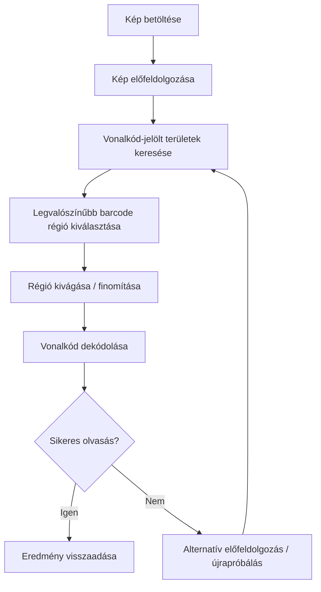
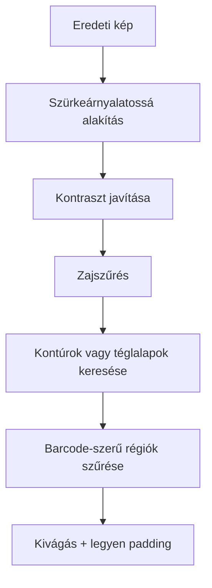
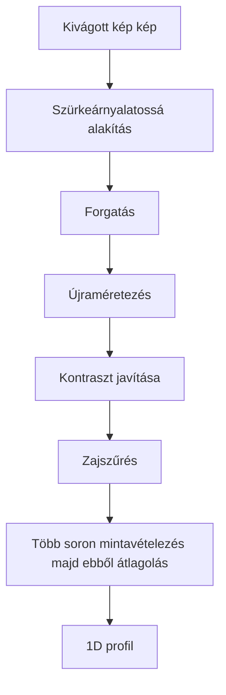
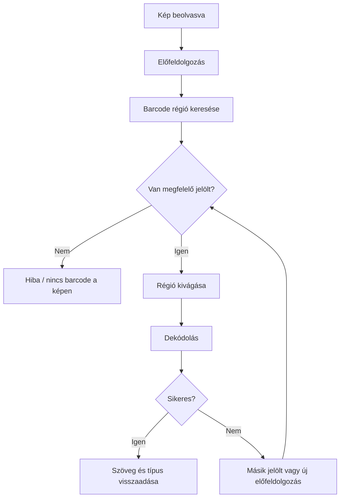
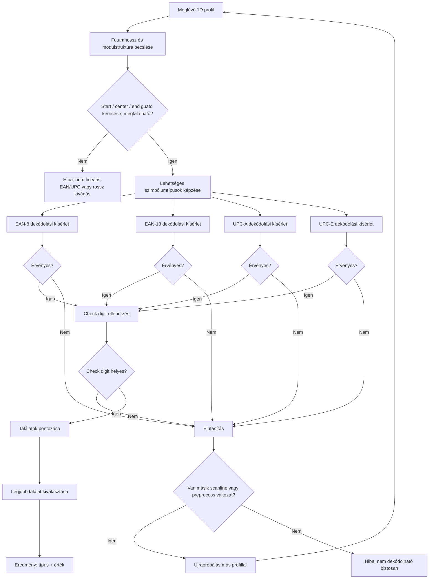

# Barcode beolvasása

## Folyamatdiagram

```mermaid
flowchart TD
    A[Kép betöltése] --> B[Kép előfeldolgozása]
    B --> C[Vonalkód-jelölt területek keresése]
    C --> D[Legvalószínűbb barcode régió kiválasztása]
    D --> E[Régió kivágása / finomítása]
    E --> F[Vonalkód dekódolása]
    F --> G{Sikeres olvasás?}
    G -- Igen --> H[Eredmény visszaadása]
    G -- Nem --> I[Alternatív előfeldolgozás / újrapróbálás]
    I --> C
```

## Képfeldolgozás folyamata

```mermaid
flowchart TD
    A[Eredeti kép] --> B[Szürkeárnyalatossá alakítás]
    B --> C[Kontraszt javítása]
    C --> D[Zajszűrés]
    D --> G[Kontúrok vagy téglalapok keresése]
    G --> H[Barcode-szerű régiók szűrése]
    H --> I[Kivágás + legyen padding]
```

## Kivágott kép feldolgozási folyamata

```mermaid
flowchart TD
    A[Kivágott kép kép] --> B[Szürkeárnyalatossá alakítás]
    B --> D[Forgatás]
    D --> C[Újraméretezés]
    C --> E[Kontraszt javítása]
    E --> G[Zajszűrés]
    G --> H[Több soron mintavételezés majd ebből átlagolás]
    H --> J[1D profil]
```

## Döntési logika a folyamat során

```mermaid
flowchart TD
    A[Kép beolvasva] --> B[Előfeldolgozás]
    B --> C[Barcode régió keresése]
    C --> E{Van megfelelő jelölt?}
    E -- Nem --> G[Hiba / nincs barcode a képen]
    E -- Igen --> H[Régió kivágása]
    H --> I[Dekódolás]
    I --> J{Sikeres?}
    J -- Igen --> K[Szöveg és típus visszaadása]
    J -- Nem --> L[Másik jelölt vagy új előfeldolgozás]
    L --> E
```

### 1D profil értelmezése

```mermaid
flowchart TD
    G[Meglévő 1D profil]
    G --> H[Futamhossz és modulstruktúra becslése]
    H --> I{Start / center / end guatd keresése, megtalálható?}
    I -- Nem --> Z1[Hiba: nem lineáris EAN/UPC vagy rossz kivágás]
    I -- Igen --> J[Lehetséges szimbólumtípusok képzése]
    J --> K[EAN-8 dekódolási kísérlet]
    J --> L[EAN-13 dekódolási kísérlet]
    J --> M[UPC-A dekódolási kísérlet]
    J --> N[UPC-E dekódolási kísérlet]
    K --> O{Érvényes?}
    L --> P{Érvényes?}
    M --> Q{Érvényes?}
    N --> R{Érvényes?}
    O -- Igen --> S[Check digit ellenőrzés]
    P -- Igen --> S
    Q -- Igen --> S
    R -- Igen --> S
    O -- Nem --> T[Elutasítás]
    P -- Nem --> T
    Q -- Nem --> T
    R -- Nem --> T
    S --> U{Check digit helyes?}
    U -- Nem --> T
    U -- Igen --> V[Találatok pontozása]
    T --> W{Van másik scanline vagy preprocess változat?}
    W -- Igen --> X[Újrapróbálás más profillal]
    X --> G
    W -- Nem --> Y[Hiba: nem dekódolható biztosan]
    V --> AA[Legjobb találat kiválasztása]
    AA --> AB[Eredmény: típus + érték]
```
