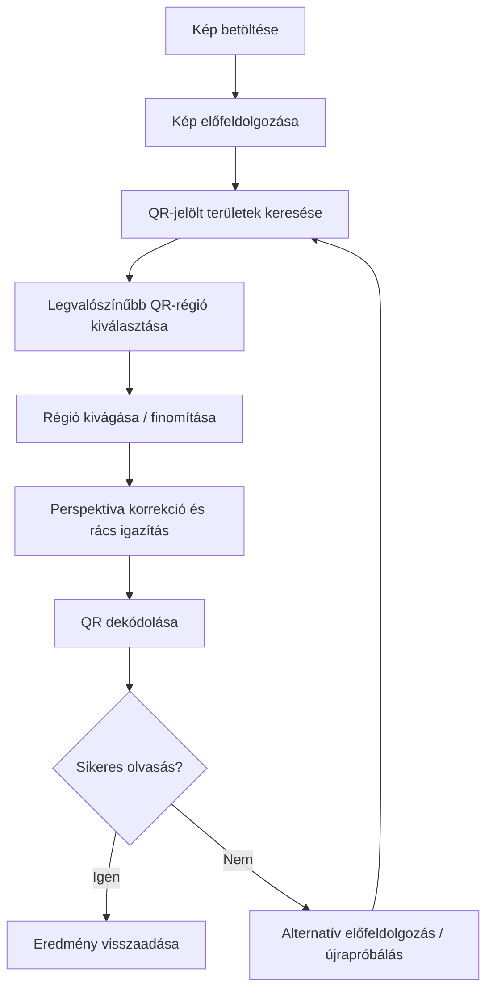
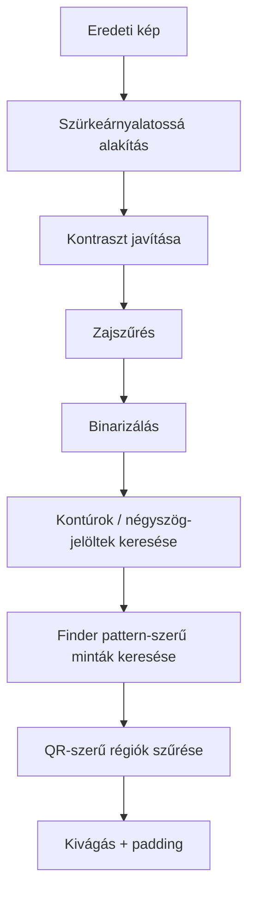
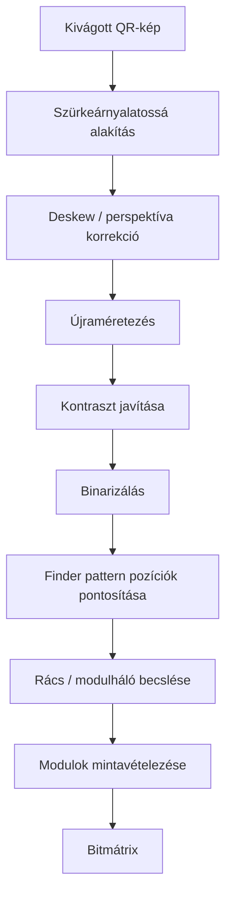
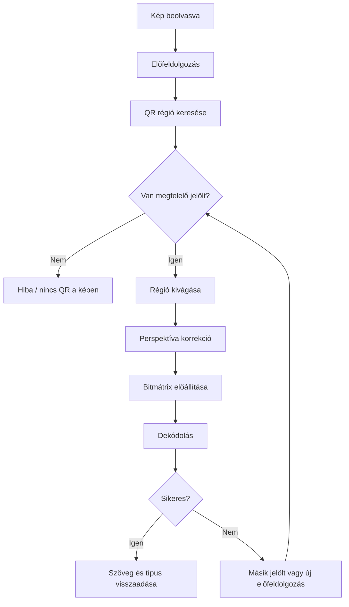
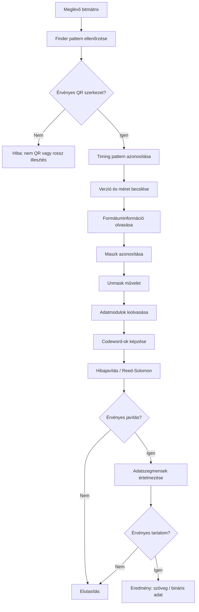

# QR Code beolvasása

## Folyamatdiagram

```mermaid
flowchart TD
    A[Kép betöltése] --> B[Kép előfeldolgozása]
    B --> C[QR-jelölt területek keresése]
    C --> D[Legvalószínűbb QR-régió kiválasztása]
    D --> E[Régió kivágása / finomítása]
    E --> F[Perspektíva korrekció és rács igazítás]
    F --> G[QR dekódolása]
    G --> H{Sikeres olvasás?}
    H -- Igen --> I[Eredmény visszaadása]
    H -- Nem --> J[Alternatív előfeldolgozás / újrapróbálás]
    J --> C
```

## Képfeldolgozás folyamata

```mermaid
flowchart TD
    A[Eredeti kép] --> B[Szürkeárnyalatossá alakítás]
    B --> C[Kontraszt javítása]
    C --> D[Zajszűrés]
    D --> E[Binarizálás]
    E --> F[Kontúrok / négyszög-jelöltek keresése]
    F --> G[Finder pattern-szerű minták keresése]
    G --> H[QR-szerű régiók szűrése]
    H --> I[Kivágás + padding]
```

## Kivágott kép feldolgozási folyamata

```mermaid
flowchart TD
    A[Kivágott QR-kép] --> B[Szürkeárnyalatossá alakítás]
    B --> C[Deskew / perspektíva korrekció]
    C --> D[Újraméretezés]
    D --> E[Kontraszt javítása]
    E --> F[Binarizálás]
    F --> G[Finder pattern pozíciók pontosítása]
    G --> H[Rács / modulháló becslése]
    H --> I[Modulok mintavételezése]
    I --> J[Bitmátrix]
```

## Döntési logika a folyamat során

```mermaid
flowchart TD
    A[Kép beolvasva] --> B[Előfeldolgozás]
    B --> C[QR régió keresése]
    C --> D{Van megfelelő jelölt?}
    D -- Nem --> E[Hiba / nincs QR a képen]
    D -- Igen --> F[Régió kivágása]
    F --> G[Perspektíva korrekció]
    G --> H[Bitmátrix előállítása]
    H --> I[Dekódolás]
    I --> J{Sikeres?}
    J -- Igen --> K[Szöveg és típus visszaadása]
    J -- Nem --> L[Másik jelölt vagy új előfeldolgozás]
    L --> D
```

## Bitmátrix értelmezése

```mermaid
flowchart TD
    A[Meglévő bitmátrix]
    A --> B[Finder pattern ellenőrzése]
    B --> C{Érvényes QR szerkezet?}
    C -- Nem --> D[Hiba: nem QR vagy rossz illesztés]
    C -- Igen --> E[Timing pattern azonosítása]
    E --> F[Verzió és méret becslése]
    F --> G[Formátuminformáció olvasása]
    G --> H[Maszk azonosítása]
    H --> I[Unmask művelet]
    I --> J[Adatmodulok kiolvasása]
    J --> K[Codeword-ok képzése]
    K --> L[Hibajavítás / Reed-Solomon]
    L --> M{Érvényes javítás?}
    M -- Nem --> N[Elutasítás]
    M -- Igen --> O[Adatszegmensek értelmezése]
    O --> P{Érvényes tartalom?}
    P -- Nem --> N
    P -- Igen --> Q[Eredmény: szöveg / bináris adat]
```
